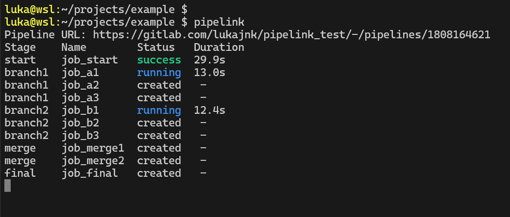
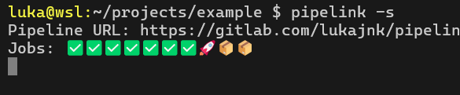
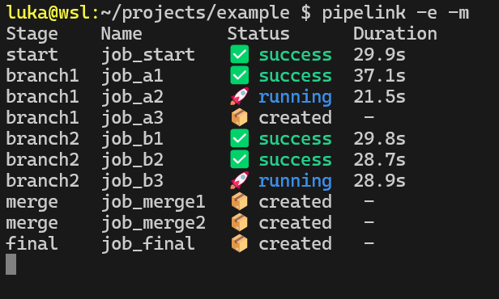

# Pipelink

Monitor your Gitlab CI/CD pipelines from the terminal. Pipelink is a bash script that fetches real time information about your pipeline jobs using Gitlab's API.

  

### Features
- Monitor pipeline jobs live in the terminal.
- Get a direct URL to the latest pipeline of your current Git branch.
- Project configuration saved locally with tokens and directories.
- Optional emoji-based and colored status for clarity at a glance.

  

## Installation

### Curl
    bash <(curl -s https://gitlab.com/lukajnk/pipelink/-/raw/main/install.sh)

### Brew
    brew tap lukajnk/pipelink
    brew install pipelink

  
##### Requirements
    bash curl git jq

  
## Usage
    pipelink [command] [arguments]

    commands
        run               run a project (default command)
        add               add a new project
        list              list all saved projects

    arguments
        -p | --project    [project name]   specify project name
        -t | --token      [access token]   specify personal access token
        -d | --directory  [directory]      specify directory
        -i | --interval   [interval]       specify jobs status refresh interval in seconds
        -l | --link                        only show pipeline URL, skip job status monitoring
        -m | --monitor                     only monitor jobs, skip pipeline URL
        -o | --once                        show job status only once
        -s | --small                       small mode, single line status (only emojis)
        -c | --colored                     colored mode
        -e | --emoji                       emoji 🔥 mode
             --clear                       clear screen on start
        -v | --version                     show version
        -h | --help                        show help
             --debug                       show debug info

        arguments can also contain values in the form:
        --monitor="true" --interval="10" --project="batcave"

        projects are saved in '/home/luka/.config/pipelink/projects' and the
        default settings can be customized in '/home/luka/.config/pipelink/config'

### Config files
Projects are saved in `~/.config/pipelink/projects` and global default settings can be changed in the config file `~/.config/pipelink/config`.

## Examples

  

  

